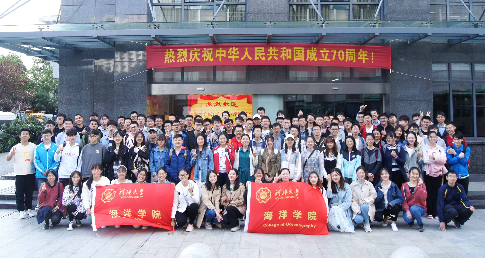

一、课程名称
海洋科学认识实习
Marine Science Cognition Practice

二、学分学时
1.0学分 / 16学时

三、使用主体教材和线上资源
无

四、课程属性
实践课程
必修

五、教学对象
海洋科学专业本科生

六、开课单位
海洋学院

七、先修课程
海洋科学导论、大气科学导论、地球科学导论、物理海洋学、海洋调查方法

八. 教学内容
海洋科学的研究动态和前沿，海洋观测仪器的功能与操作，江浙沿海海洋、气象要素特征与潮波的运动规律。

九. 考核方式
海洋科学认识实习课程为必修课，课程考核方式包括：实习期间综合表现（40%）+课程总结报告（60%）。
1．实习期间综合表现（40%）
根据学生在实习期间的综合表现情况进行评定。具体包括：实习期间的纪律表现、实习过程中的提问与思考等表现。
2．提交的报告及笔记（60%）
以实习报告的形式进行评定。实习报告主要考察的内容包括：对本课程目的的理解、实习过程中对具体科学问题的思考、与海洋科学基础知识的结合情况、对海洋科学方向职业规划的思考、对海洋科学在国家经济国防建设中重要地位的理解和思考、实习报告的语言表述与格式等。
