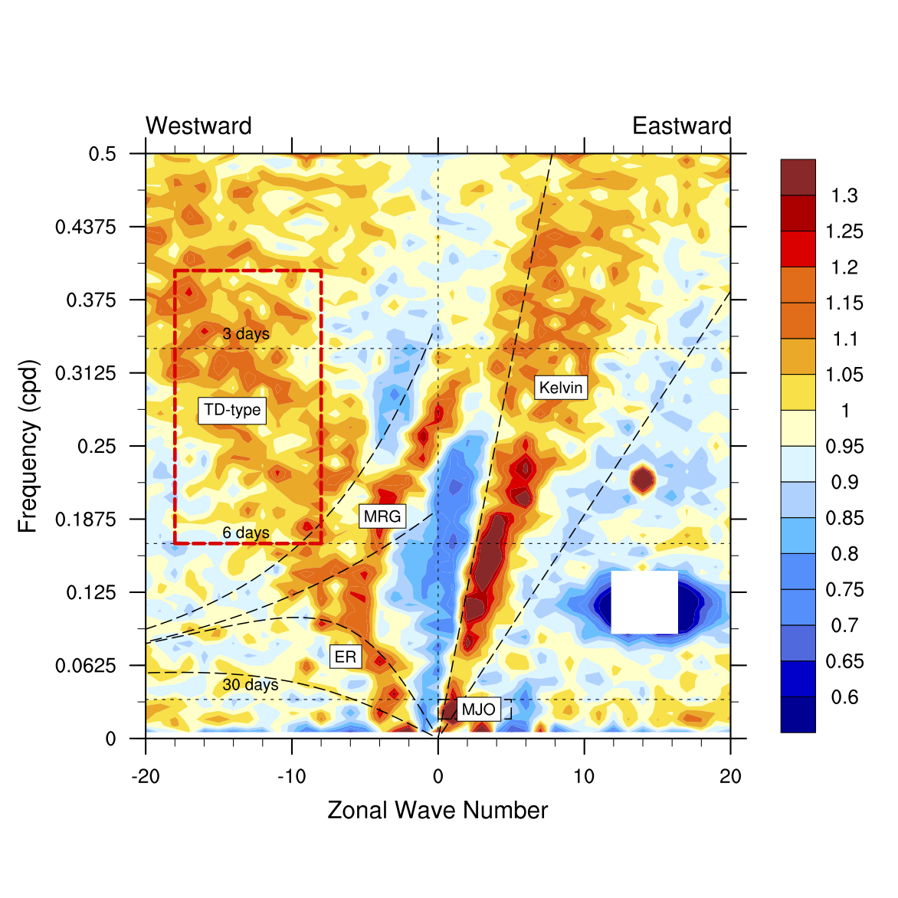

### 研究兴趣

我的研究兴趣主要在三个方向:

- 对流耦合波动
- 台风多尺度变率
- 热带对流

热带波动指的是热带大气中的一些振荡现象,它们的发展往往伴随着深对流的活动，因此被称作对流耦合波动。这些沿着赤道传播的波动将大气的动能与水汽输送到热带的各个区域，影响热带地区的天气变化。

----

#### 对流耦合波动

热带大气动力学的基础是Matsuno(1966)年的开创性工作，他通过简单的浅水模型得到了赤道波动的波解，预言了低纬大气中存在四种天气尺度的波动。然而，现在卫星观测与频谱分析表明，热带大气中除了有Matsuno(1966)所述的四种波动以外，还具有另外两种波动现象，即MJO和热带低压型(TD型)波动（下图中红框的区域）。TD波因为

